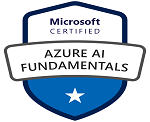

I'm a passionate software developer with over 3 years of professional experience. Love to code and design algorithms, large scale distributed systems for real world problems.
  
I’ve been working on technologies like C#,.NET Core, REST API, Windows Services, MS SQL Server, Kusto, SSIS and ADF ETL, Power Automate, Power App, Power BI.

 __I'm a huge fan of automation and enthusiast of `software craftsmanship`, `clean code` and `domain driven design`.__

  
I have decided to open down my thoughts about `.NET`,`DevOps` and `Azure Cloud` related topics.
I have just started writing blogs! and really enjoying it!

<a href="" id="mailaddress"><i class="fa fa-envelope-square"></i></a>
<a href="https://twitter.com/hiray_raj"><i class="fa fa-twitter"></i></a>
<a href="https://www.linkedin.com/in/rajendra-hiray-aa137010b/"><i class="fa fa-linkedin"></i></a>

<table class="certificats level1">
    <tr>
        <td></td>
        <td></td>
        <td></td>
        <td></td>
    </tr>
</table>

<table class="certificats level2">
    <tr>
        <td></td>
        <td></td>
        <td></td>
    </tr>
</table>
<table class="certificats level3">
    <tr>
        <td></td>
    </tr>
</table>

