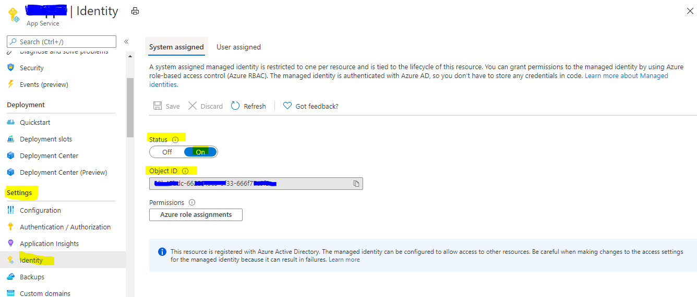
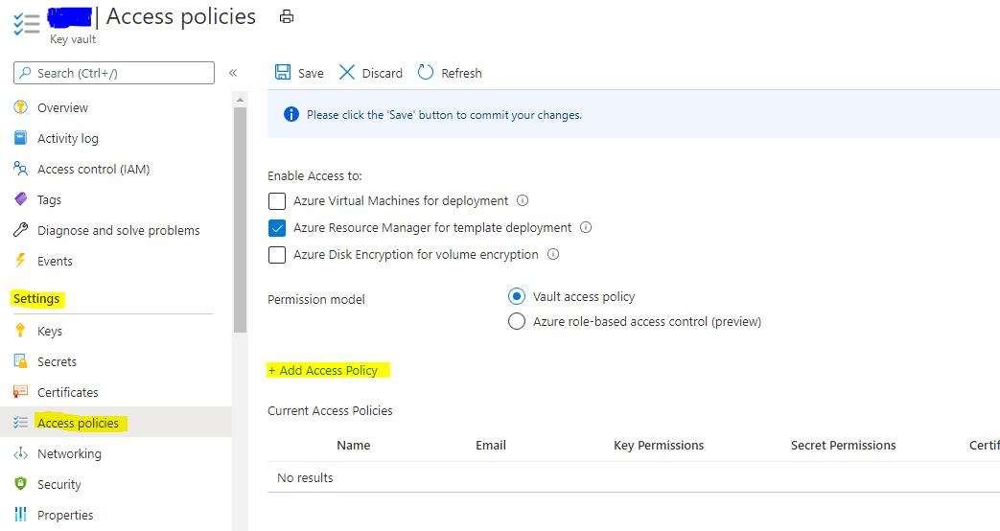
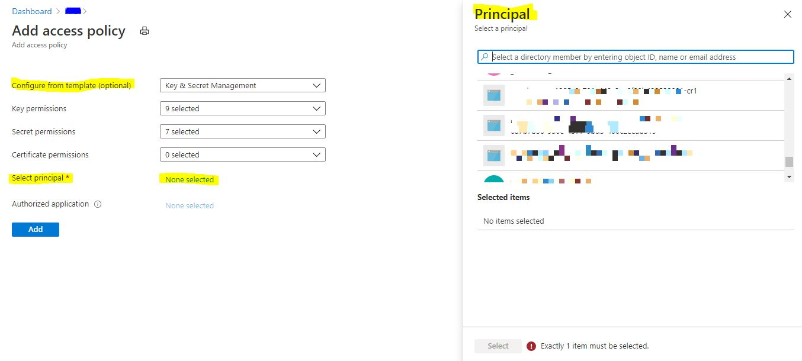
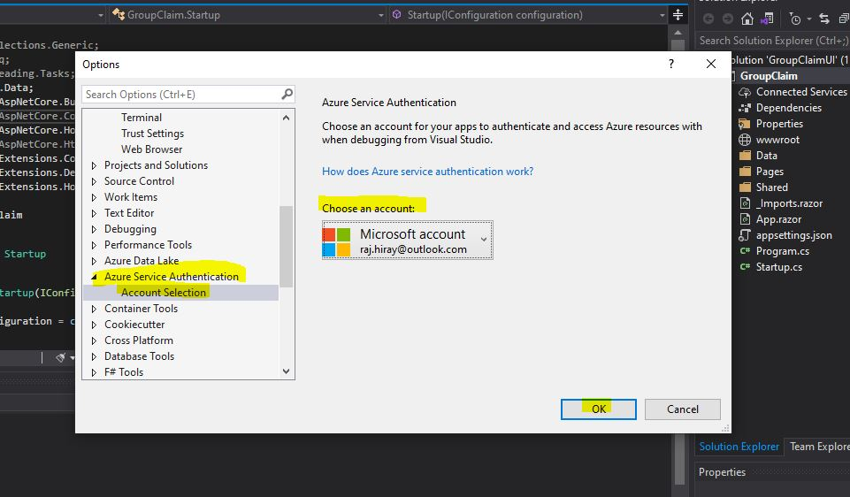

---
With any key/password store I always thought that the weak link was the credentials used to access it. If that single point of failure was compromised then all your secrets would be vulnerable. `Microsoft` have overcome this by creating the `Managed Identity`. A Managed Identity is generated by a resource within Azure and can be configured to access resources that use Azure AD for authentication.

## Managed Identity ##

Managed identities for Azure resources is a feature of the `Azure Active Directory`.

A common challenge when building cloud applications is how to manage the credentials in your code for authenticating to cloud services. Keeping the credentials secure is an important task. Ideally, the credentials never appear on developer workstations and aren't checked into source control. Azure Key Vault provides a way to securely store credentials, secrets, and other keys, but your code has to authenticate to Key Vault to retrieve them.

The managed identities for Azure resources feature in Azure Active Directory (Azure AD) solves this problem. The feature provides Azure services with an automatically managed identity in Azure AD. __You can use the identity to authenticate to any service that supports Azure AD authentication, including Key Vault, without any credentials in your code.__

## Implementation of Managed Identity ##

1. __How to use managed identities for App Service and Azure Functions__ <br>
    __Step 1: Add a system-assigned/User-assigned identity__
    * GO to https://portal.azure.com/
    * Search for __App Services__ and Select your App Service.
    * Navigate to __Setting => Identity__
    * __Set status to “On”__ it will generate object ID this id is unique id of resource which we will use to provide access of different resources for app service/azure function.
    

    __Step 2: Add Service Identity/Principal in Key vault access policy__
    * GO to https://portal.azure.com/
    * Search for __Key vault__ and Select your Key vault instance.
    * Add __Access Policy.__
        * Navigate to __Setting => Access policies => + Add Access Policy.__
        
    * Add access policy from template or provide access level by manual.
        * Select __principal__ => search App service by object Id (managed Identity) => Add
        
    
    __Step 3:  Code Level Implementation__
    * Add NuGet packages to your project.
        * `Microsoft.Azure.KeyVault`
        * `Microsoft.Azure.Services.AppAuthentication`
    * Code
        ```csharp
        /// <summary>
        /// Get Secret from key vault.
        /// </summary>
        /// <param name="kvName">Key Vault Name</param>
        /// <param name="secretName">Secret Name</param>
        /// <returns> Secret value</returns>
        static string GetSecretFromKeyVault(string kvName, string secretName)
        {
            string result = string.Empty;
            string keyVaultBaseUrl = "https://{0}.vault.azure.net/";
            var azureServiceTokenProvider = new AzureServiceTokenProvider();
            var kvClient = new KeyVaultClient(new KeyVaultClient.AuthenticationCallback(azureServiceTokenProvider.KeyVaultTokenCallback));
            result = kvClient.GetSecretAsync(string.Format(keyVaultBaseUrl, kvName), secretName).Result.Value;
            return result;
        }        
        ```

1. __Local development__ <br>
    Local machines don't support managed identities for Azure resources. As a result, the `Microsoft.Azure.Services.AppAuthentication` library uses your developer credentials to run in your local development environment. When the solution is deployed to Azure, the library uses a managed identity to switch to an OAuth 2.0 client credential grant flow. This approach means you can test the same code locally and remotely without worry.
    For local development, `AzureServiceTokenProvider` fetches tokens using __Visual Studio, Azure command-line interface (CLI), or Azure AD Integrated Authentication.__ Each option is tried sequentially and the library uses the first option that succeeds. If no option works, an `AzureServiceTokenProviderException` exception is thrown with detailed information.

    __Authenticating with Visual Studio__ <br>
    To authenticate by using Visual Studio:
    1. Sign in to Visual Studio and use __Tools > Options__ to open Options.
    2. Select __Azure Service Authentication__, choose an account for local development, and select OK.
    

If you run into problems using Visual Studio, such as errors that involve the token provider file, carefully review the preceding steps.
You may need to reauthenticate your developer token. To do so, select __Tools > Options__, and then select __Azure Service Authentication__. Look for a __Re-authenticate__ link under the selected account. Select it to authenticate.

__References:__

https://docs.microsoft.com/en-us/azure/active-directory/managed-identities-azure-resources/overview

https://docs.microsoft.com/en-us/azure/key-vault/general/service-to-service-authentication

https://docs.microsoft.com/en-us/azure/app-service/overview-managed-identity?tabs=dotnet

