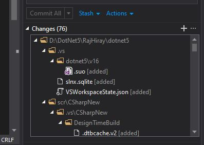

---

How do you treat files you don’t want to include in your commit?

Write it in `.gitignore`, isn’t it?

How you treat files you want to ignore in every git repository? __always put file name in .gitignore?__

For example you are using `Visual Studio 2019` IDE, VS19 will create .vs folder in your project folder.
you always ignore these files in every single project you’re working on by configuring in project level or repository level .gitignore.

I clone one repository and open in VS2019 and it started showing me a lot of changes,
even if I hadn't add/modify single line.



Suppose, you are working with other developer and every developer use his favorite IDE.
What happened?
__your .gitignore will get messy with list of file created by IDE.__

If everyone would commit their `environment-specific` .gitignore rules, we’d have a long list to maintain! My repository doesn’t care about your editor configuration.

There’s a better solution to this: a personal, `global .gitignore` file for all your repositories.

__Step 1: check whether it’s configure or not use command below:__

```Bash
git config --get core.excludesfile
```

In my case when I ran it, my global exclude file configured to

```Bash
~/.gitignore_global
```

If you have already gitignore_global configured, you can add/modify more rules in same file.

__Step 2: Configure global gitignore__

If your global not yet configure, we can add new .gitignore_global.

First, create a new .gitignore_global file in home directory (C:\Users\CurrentUser\\) for your global rules.

Next, open it with your text editor of choice and add whatever files and folders you always want to ignore.

If your not sure about rules for your IDE check on [github .gitignore](https://github.com/github/gitignore)

For Example - for [Visual Studio .gitignore template](https://github.com/github/gitignore/blob/master/VisualStudio.gitignore)
copy template rules into your .gitignore_global and save.

Finally, configure git to use our newly created ~/.gitignore_global file.

```Bash
git config --global core.excludesfile '~/.gitignore_global'
```

command above will create and set global git ignore file to ~/.gitignore_global

That’s it, no more pesky editor configuration in your commits!
