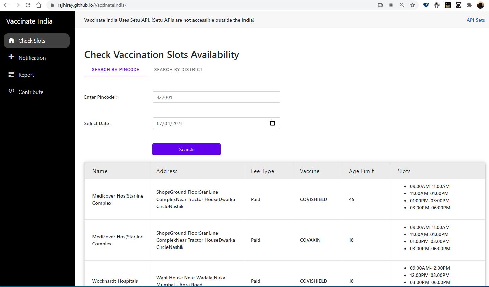

## Vaccinate India
	
The government’s official website <a href="https://www.cowin.gov.in/" target="_blank"> cowin.gov.in </a> has a useful search section that allows you see the nearby vaccination centers in your `city or zip code`. You’ll also know how many vaccine doses are available at a specific center and the earliest date when the vaccine slots are likely to open up.

Based on the public <a href="https://apisetu.gov.in/" target="_blank"> CoWIN API </a> , I have developed an `open-source` vaccine tracker that will automatically monitor vaccine availability near your location and will `send email alerts` as stocks become available.

- **Site :** [VaccinateIndia](https://rajhiray.github.io/VaccinateIndia/)
- **Article :** [Get Email Alerts When COVID-19 Vaccines Become Available Near You.](/post/covid19-vaccine-tracker/)
- **Repository :** [RajHiray/VaccinateIndia](https://github.com/RajHiray/VaccinateIndia)
